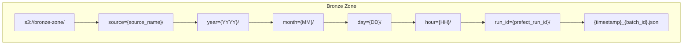
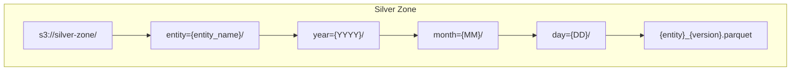
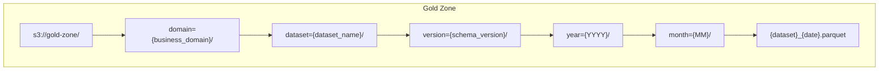

## Data Lake Architecture

### Medallion Architecture Pattern

The Bronze → Silver → Gold pattern provides clear data quality tiers:

#### Bronze Zone (Raw Data)

- **Purpose**: Preserve raw data exactly as received
- **Format**: Original format (JSON, CSV, API responses)
- **Partitioning**: By source, ingestion time
- **Retention**: Long-term (archive to Glacier after 90 days)
- **Schema**: No schema enforcement

#### Silver Zone (Cleansed Data)

- **Purpose**: Standardized, deduplicated, validated data
- **Format**: Parquet with compression
- **Partitioning**: By business entity and time
- **Retention**: Medium-term (1-2 years hot storage)
- **Schema**: Enforced via Glue Schema Registry

#### Gold Zone (Business Data)

- **Purpose**: Aggregated, business-ready datasets
- **Format**: Parquet optimized for analytics
- **Partitioning**: By use case and access patterns
- **Retention**: Based on business needs
- **Schema**: Documented business glossary

