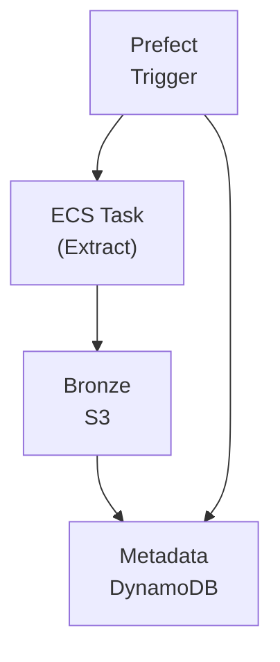
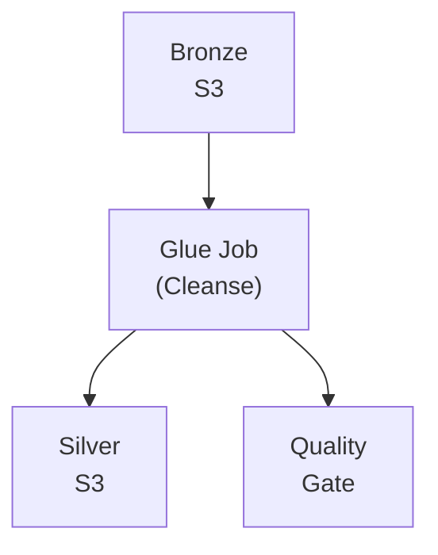
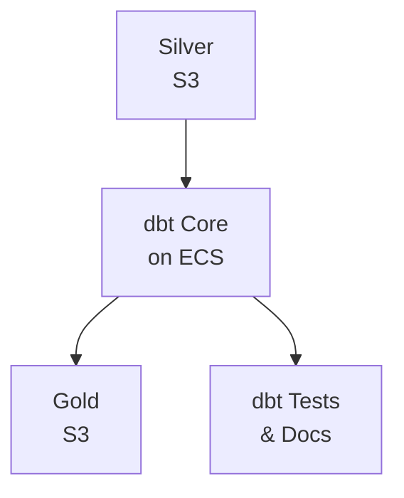

## Detailed Flow

### Data Ingestion Flow



1. **Scheduled Trigger**: Prefect Server initiates flow based on schedule or event
2. **Ephemeral Extraction**: Prefect spins up ECS task for specific data source
3. **Raw Data Landing**: Extracted data written to Bronze zone with metadata
4. **Lineage Tracking**: Metadata recorded in DynamoDB for audit trail

#### Handling Historical Backfills

The architecture is designed to support large-scale historical backfills. Prefect flows are parameterized (e.g., by `start_date` and `end_date`). A backfill can be triggered by running a flow with a date range, and Prefect's concurrency capabilities will schedule and manage the parallel execution of hundreds or thousands of historical tasks.

```python
@flow(name="backfill-ingestion")
def backfill_historical_data(
    source: str,
    start_date: datetime,
    end_date: datetime,
    parallel_days: int = 30
):
    """Backfill historical data with parallel execution"""

    # Generate date ranges for parallel processing
    date_ranges = generate_date_chunks(start_date, end_date, parallel_days)

    # Submit parallel ingestion tasks
    futures = []
    for date_range in date_ranges:
        future = ingest_data.submit(
            source=source,
            start_date=date_range[0],
            end_date=date_range[1]
        )
        futures.append(future)

    # Wait for all tasks to complete
    results = [future.result() for future in futures]

    # Trigger downstream processing
    trigger_silver_processing(source, start_date, end_date)
```

### Data Processing Flow



1. **Bronze to Silver**: AWS Glue job performs schema validation and cleansing
2. **Quality Gates**: Data quality checks must pass before promotion
3. **Schema Registry**: Validated schemas registered for downstream use

### Transformation Flow



1. **Business Logic**: dbt models transform Silver data to Gold
2. **Testing**: dbt tests ensure transformation quality
3. **Documentation**: Auto-generated documentation for lineage
