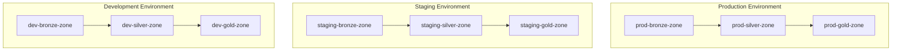

# Environment Management

This document describes how the Finks data pipeline manages multiple environments (development, staging, production) across all repositories and infrastructure components.

## Overview

The Finks data platform implements a three-tier environment strategy that provides isolation, safety, and progressive deployment capabilities:

- **Development (dev)**: For active development and testing
- **Staging**: Production-like environment for integration testing
- **Production (prod)**: Live data processing environment

### Environment vs. Medallion Architecture

It's important to understand that environments and the medallion architecture serve different purposes:



- **Environments**: Provide isolation between development work and production systems
- **Medallion Architecture**: Ensures data quality progression within each environment

## Environment Configuration Strategy

### Configuration Files

All repositories use Python-dotenv with environment-specific `.env` files:

```
finks-{repository}/
├── config/
│   ├── .env.dev          # Development configuration
│   ├── .env.staging      # Staging configuration  
│   ├── .env.prod         # Production configuration
│   ├── .env.example      # Template (committed to git)
│   └── config.py         # Configuration loader
```

### Configuration Loader Pattern

Each repository implements a standard configuration loader:

```python
# config/config.py
import os
from pathlib import Path
from dotenv import load_dotenv

def load_environment():
    """Load environment-specific .env file"""
    env = os.getenv("ENVIRONMENT", "dev")
    env_file = Path(__file__).parent / f".env.{env}"
    
    if not env_file.exists():
        raise FileNotFoundError(f"Missing {env_file}")
    
    load_dotenv(env_file, override=True)
    return env

ENVIRONMENT = load_environment()

class Config:
    # AWS Configuration
    AWS_REGION = os.getenv("AWS_REGION", "ca-central-1")
    S3_BUCKET_PREFIX = os.getenv("S3_BUCKET_PREFIX")
    
    # Computed values
    BRONZE_BUCKET = f"{S3_BUCKET_PREFIX}-bronze-zone"
    SILVER_BUCKET = f"{S3_BUCKET_PREFIX}-silver-zone"
    GOLD_BUCKET = f"{S3_BUCKET_PREFIX}-gold-zone"
```

## Repository-Specific Implementation

### finks-infrastructure

Uses Pulumi stacks for complete infrastructure isolation:

```bash
pulumi stack select dev      # Development infrastructure
pulumi stack select staging  # Staging infrastructure
pulumi stack select prod     # Production infrastructure
```

Configuration files:
```yaml
# config/dev.yaml
aws:region: ca-central-1
instance_type: t3.small
retention_days: 7

# config/prod.yaml
aws:region: ca-central-1
instance_type: t3.large
retention_days: 365
```

### finks-pipelines

Prefect flows are environment-aware:

```python
# flows/config.py
from config import Config

@flow(name=f"ingest-fmp-{Config.ENVIRONMENT}")
def ingest_fmp_data():
    """Environment-specific flow"""
    target_bucket = Config.BRONZE_BUCKET
    # Flow implementation
```

### finks-dbt

dbt profiles support multiple environments:

```yaml
# profiles.yml
config:
  send_anonymous_usage_stats: false

finks:
  outputs:
    dev:
      type: athena
      region_name: ca-central-1
      database: dev_analytics
      s3_staging_dir: s3://dev-athena-results/
      
    staging:
      type: athena
      region_name: ca-central-1
      database: staging_analytics
      s3_staging_dir: s3://staging-athena-results/
      
    prod:
      type: athena
      region_name: ca-central-1
      database: prod_analytics
      s3_staging_dir: s3://prod-athena-results/

  target: "{{ env_var('DBT_TARGET', 'dev') }}"
```

### finks-ingestion

Connectors read environment-specific targets:

```python
# connectors/fmp/main.py
from config import Config

def extract_data():
    """Extract data to environment-specific bucket"""
    s3_client = boto3.client('s3')
    bucket = Config.BRONZE_BUCKET
    # Extraction logic
```

## CI/CD Integration

### Progressive Deployment Strategy

All repositories follow a consistent deployment pattern:

```yaml
# .github/workflows/deploy.yml
name: Deploy

on:
  push:
    branches: [main]
  release:
    types: [published]

jobs:
  deploy-dev:
    if: github.ref == 'refs/heads/main'
    runs-on: ubuntu-latest
    steps:
      - uses: actions/checkout@v3
      - name: Deploy to Development
        env:
          ENVIRONMENT: dev
        run: ./scripts/deploy.sh

  deploy-staging:
    needs: deploy-dev
    if: github.ref == 'refs/heads/main'
    runs-on: ubuntu-latest
    steps:
      - uses: actions/checkout@v3
      - name: Deploy to Staging
        env:
          ENVIRONMENT: staging
        run: ./scripts/deploy.sh

  deploy-prod:
    if: github.event_name == 'release'
    runs-on: ubuntu-latest
    environment: production  # Requires manual approval
    steps:
      - uses: actions/checkout@v3
      - name: Deploy to Production
        env:
          ENVIRONMENT: prod
        run: ./scripts/deploy.sh
```

## Environment-Specific Resources

### Infrastructure Sizing

| Resource | Development | Staging | Production |
|----------|------------|---------|------------|
| ECS Fargate | 0.5 vCPU, 1GB | 1 vCPU, 2GB | 2 vCPU, 4GB |
| RDS PostgreSQL | db.t3.micro | db.t3.small | db.t3.medium (Multi-AZ) |
| S3 Retention | 7 days | 30 days | 365 days |
| Prefect Agents | 1 | 2 | 3 |

### Cost Optimization

- **Dev**: Uses Fargate Spot, minimal retention, single AZ
- **Staging**: Production-like but single AZ, shorter retention
- **Production**: Full HA, multi-AZ, long-term retention

## Local Development

Developers can run a complete local environment:

```yaml
# docker-compose.yml
services:
  prefect-server:
    image: prefecthq/prefect:latest
    environment:
      - PREFECT_SERVER_API_HOST=0.0.0.0
    ports:
      - "4200:4200"
      
  localstack:
    image: localstack/localstack:latest
    environment:
      - SERVICES=s3,glue,athena
    ports:
      - "4566:4566"
```

Set environment for local development:
```bash
export ENVIRONMENT=dev
python -m flows.main
```

## Security Considerations

### Secret Management

Each environment has isolated secrets:

```
AWS Secrets Manager:
├── /dev/prefect/api_key
├── /dev/fmp/api_key
├── /staging/prefect/api_key
├── /staging/fmp/api_key
├── /prod/prefect/api_key
└── /prod/fmp/api_key
```

### Access Control

- **Dev**: Developers have broad access
- **Staging**: Limited to CI/CD and senior developers
- **Production**: Restricted access, audit logging enabled

## Best Practices

### 1. Environment Promotion

Always promote code through environments:
```
Local → Dev → Staging → Production
```

### 2. Configuration Validation

```python
def validate_config():
    """Validate configuration based on environment"""
    if Config.ENVIRONMENT == "prod":
        assert Config.S3_BUCKET_PREFIX == "prod"
        assert not Config.DEBUG_MODE
        assert Config.LOG_LEVEL == "INFO"
```

### 3. Environment Indicators

Make it obvious which environment you're in:

```python
# Prefect flow names
flow_name = f"process-data-{Config.ENVIRONMENT}"

# Log messages
logger.info(f"Starting pipeline in {Config.ENVIRONMENT} environment")

# Slack notifications
slack_message = f"[{Config.ENVIRONMENT.upper()}] Pipeline completed"
```

### 4. Data Isolation

Never allow cross-environment data access:

```python
# ❌ Bad
bucket = "prod-bronze-zone"  # Hardcoded

# ✅ Good  
bucket = Config.BRONZE_BUCKET  # Environment-aware
```

### 5. Testing Strategy

- **Dev**: Unit tests, integration tests with small data
- **Staging**: Full integration tests, performance tests
- **Production**: Smoke tests only, monitoring

## Troubleshooting

### Common Issues

1. **Wrong Environment Loaded**
   ```bash
   # Check current environment
   echo $ENVIRONMENT
   
   # Force specific environment
   ENVIRONMENT=staging python main.py
   ```

2. **Missing Environment File**
   ```bash
   # Copy from example
   cp config/.env.example config/.env.dev
   # Edit with your values
   ```

3. **Cross-Environment Contamination**
   - Check S3 bucket names in logs
   - Verify Prefect API URL
   - Confirm database connections

## Migration Guide

When adding environment support to existing code:

1. Create config directory structure
2. Add `.env.*` files to `.gitignore`
3. Replace hardcoded values with `Config` references
4. Update CI/CD workflows
5. Test each environment thoroughly

## Summary

The three-tier environment strategy provides:

- **Safety**: Isolated development and testing
- **Confidence**: Production-like staging validation
- **Flexibility**: Environment-specific optimizations
- **Cost Control**: Right-sized resources per environment

All repositories follow consistent patterns for configuration, deployment, and operation across environments.