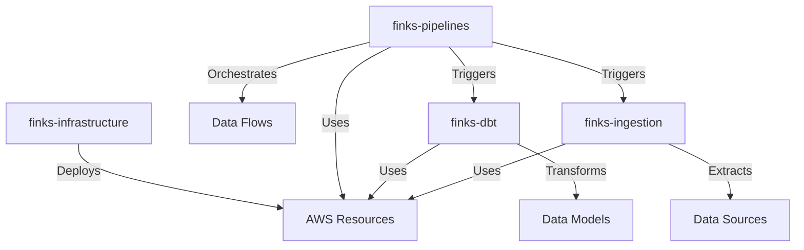
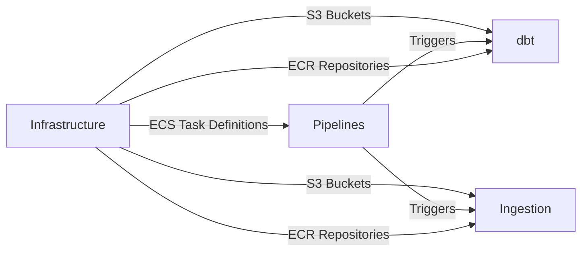

# Repository Structure

The Finks data pipeline is organized across multiple repositories, each with a specific purpose and ownership. This separation enables independent development cycles, focused CI/CD pipelines, and clear ownership boundaries.

## Repository Overview



## Repository Details

### 1. finks-infrastructure

**Purpose**: Infrastructure as Code for all AWS resources

**Repository**: `https://github.com/finks-ai/finks-infrastructure`

**Owner**: Platform/DevOps Engineer

**Technology Stack**:
- Pulumi (Python)
- AWS SDK
- GitHub Actions

**Contents**:
```
finks-infrastructure/
├── __main__.py                 # Main Pulumi entry point
├── components/
│   ├── networking.py          # VPC, subnets, security groups
│   ├── data_lake.py           # S3 buckets, lifecycle policies
│   ├── orchestration.py       # ECS cluster, Prefect infrastructure
│   ├── transformation.py      # Glue jobs, Athena setup
│   ├── api.py                # API Gateway, Lambda functions
│   └── monitoring.py          # CloudWatch dashboards, alarms
├── config/
│   ├── dev.yaml              # Development environment config
│   ├── staging.yaml          # Staging environment config
│   └── prod.yaml             # Production environment config
├── policies/                  # Pulumi policy packs
├── tests/                    # Infrastructure unit tests
└── .github/
    └── workflows/
        ├── preview.yml       # PR preview workflow
        └── deploy.yml        # Deployment workflow
```

**Key Responsibilities**:
- VPC and networking setup
- ECS clusters and task definitions
- RDS database provisioning
- S3 bucket creation and policies
- IAM roles and policies
- API Gateway and Lambda functions
- CloudWatch resources
- Secrets Manager configuration

**CI/CD Pipeline**:
1. Pull Request: `pulumi preview` shows infrastructure changes
2. Merge to main: Deploy to staging environment
3. Tag release: Deploy to production (with approval)

---

### 2. finks-pipelines

**Purpose**: Prefect flows and orchestration logic

**Repository**: `https://github.com/finks-ai/finks-pipelines`

**Owner**: Data Engineer

**Technology Stack**:
- Python 3.12+ (managed with uv)
- Prefect 2.x
- AWS SDK (boto3)
- PySpark (for Glue jobs)

**Contents**:
```
finks-pipelines/
├── flows/
│   ├── ingestion/
│   │   ├── fmp_api.py        # FMP data ingestion flow
│   │   ├── mongodb.py        # MongoDB ingestion flow
│   │   └── streaming.py      # Streaming data flow
│   ├── transformation/
│   │   ├── bronze_to_silver.py  # Glue job orchestration
│   │   └── silver_to_gold.py    # dbt orchestration
│   └── master_flow.py        # Main orchestration flow
├── blocks/
│   └── configure_blocks.py   # Prefect blocks as code
├── tasks/
│   ├── ecs_tasks.py         # ECS task utilities
│   ├── glue_tasks.py        # Glue job utilities
│   └── notifications.py     # Alert utilities
├── glue_scripts/
│   ├── cleanse_market_data.py
│   └── validate_schemas.py
├── tests/
└── .github/
    └── workflows/
        ├── test.yml         # Unit test workflow
        └── deploy_flows.yml # Deploy flows to Prefect
```

**Key Responsibilities**:
- Define and manage Prefect flows
- Orchestrate ECS tasks for ingestion
- Trigger AWS Glue jobs
- Coordinate dbt transformations
- Handle error recovery and notifications
- Manage Prefect blocks configuration

**CI/CD Pipeline**:
1. Pull Request: Run unit tests and flow validation
2. Merge to main: Deploy flows to Prefect staging
3. Tag release: Deploy to Prefect production

---

### 3. finks-dbt

**Purpose**: Data transformation models and business logic

**Repository**: `https://github.com/finks-ai/finks-dbt`

**Owner**: Analytics Engineer

**Technology Stack**:
- dbt-core 1.7+
- dbt-athena adapter
- Docker
- GitHub Actions

**Contents**:
```
finks-dbt/
├── models/
│   ├── staging/              # Bronze → Silver models
│   │   ├── fmp/
│   │   │   ├── stg_fmp_quotes.sql
│   │   │   └── stg_fmp_financials.sql
│   │   └── _sources.yml
│   ├── intermediate/         # Complex joins and logic
│   │   └── int_market_metrics.sql
│   ├── marts/               # Business-ready datasets
│   │   ├── finance/
│   │   │   ├── daily_portfolio_summary.sql
│   │   │   └── monthly_performance.sql
│   │   └── risk/
│   │       └── var_calculations.sql
│   └── _schema.yml          # Model documentation
├── tests/                   # Custom data tests
├── macros/                  # Reusable SQL functions
├── snapshots/              # SCD Type 2 history
├── dbt_project.yml
├── profiles.yml            # Connection profiles
├── Dockerfile              # Container for ECS
└── .github/
    └── workflows/
        ├── slim_ci.yml     # Test changed models only
        └── build.yml       # Build and push Docker image
```

**Key Responsibilities**:
- Define staging models from Silver zone
- Create intermediate transformations
- Build business-ready mart models
- Implement data quality tests
- Document data lineage
- Maintain business logic

**CI/CD Pipeline**:
1. Pull Request: dbt slim CI (test changed models)
2. Merge to main: Build Docker image, deploy to staging
3. Tag release: Deploy to production ECR

---

### 4. finks-ingestion

**Purpose**: Containerized data source connectors

**Repository**: `https://github.com/finks-ai/finks-ingestion`

**Owner**: Data Engineer

**Technology Stack**:
- Python 3.12+ (managed with uv)
- Docker
- Various API SDKs
- GitHub Actions

**Contents**:
```
finks-ingestion/
├── connectors/
│   ├── fmp/
│   │   ├── Dockerfile
│   │   ├── main.py          # FMP API connector
│   │   ├── schemas.py       # Data validation
│   │   └── pyproject.toml    # Dependencies managed with uv
│   ├── mongodb/
│   │   ├── Dockerfile
│   │   ├── main.py          # MongoDB connector
│   │   └── pyproject.toml    # Dependencies managed with uv
│   └── news_stream/
│       ├── Dockerfile
│       ├── main.py          # News streaming connector
│       └── pyproject.toml    # Dependencies managed with uv
├── shared/
│   ├── utils.py            # Common utilities
│   ├── s3_writer.py        # S3 upload logic
│   └── error_handling.py   # Retry logic
├── tests/
│   ├── unit/
│   └── integration/
└── .github/
    └── workflows/
        ├── test.yml        # Test all connectors
        └── build.yml       # Build and push to ECR
```

**Key Responsibilities**:
- Extract data from various sources
- Validate data against schemas
- Handle API rate limits and retries
- Write raw data to Bronze S3
- Emit metrics and logs
- Manage credentials securely

**CI/CD Pipeline**:
1. Pull Request: Run unit and integration tests
2. Merge to main: Build all containers, push to staging ECR
3. Tag release: Push to production ECR

---

## Cross-Repository Dependencies

### Build Order
1. **finks-infrastructure** - Must be deployed first
2. **finks-pipelines** - Depends on infrastructure
3. **finks-dbt** - Can be developed in parallel
4. **finks-ingestion** - Can be developed in parallel

### Integration Points



### Shared Configuration
- **AWS Region**: `ca-central-1` (defined in infrastructure)
- **S3 Paths**: Standardized across all repos
- **IAM Roles**: Created by infrastructure, used by others
- **ECR Repositories**: Created by infrastructure, images pushed by others

---

## Development Workflow

### Local Development
Each repository includes:
- Docker Compose for local testing
- LocalStack configuration where applicable
- Comprehensive README with setup instructions
- Pre-commit hooks for code quality

### Branching Strategy
All repositories follow GitFlow:
- `main`: Production-ready code
- `develop`: Integration branch
- `feature/*`: Feature development
- `hotfix/*`: Emergency fixes

### Release Process
1. Create release branch from develop
2. Test in staging environment
3. Create GitHub release with tag
4. Automated deployment to production

---

## Security Considerations

### Access Control
- **Repository Access**: Team-based permissions in GitHub
- **AWS Access**: Managed through IAM roles per repository
- **Secrets**: Never committed, always use AWS Secrets Manager

### Code Scanning
- GitHub Advanced Security enabled
- Dependabot for dependency updates
- Secret scanning to prevent credential leaks
- SAST scanning in CI/CD pipeline

---

## Monitoring and Observability

Each repository contributes to observability:
- **Infrastructure**: Creates CloudWatch dashboards
- **Pipelines**: Emits Prefect metrics and custom CloudWatch metrics
- **dbt**: Generates run artifacts and test results
- **Ingestion**: Logs extraction metrics and errors

All logs are centralized in CloudWatch Logs with consistent formatting and correlation IDs for tracing across services.