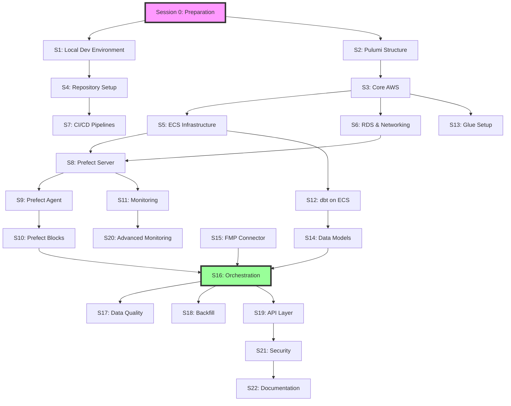

# Agentic Programming Sessions for Claude Code

This guide provides a battle-tested approach to building the Finks data pipeline using Claude Code across 22 focused sessions over 6 weeks.

## 🎯 Core Principles

1. **Context-Focused Sessions**: Each session has a single, clear objective
2. **Dependency-Aware**: Explicit dependencies and parallel opportunities
3. **Test-Driven**: Every session includes testing in its time estimate
4. **Recovery-Ready**: Each session can be re-run or recovered
5. **Progress Tracking**: Clear validation gates and success metrics

## 📊 Session Overview

| Week | Sessions | Focus | Validation Gate |
|------|----------|-------|-----------------|
| 0 | [Preparation](./week-0-preparation.md) | Environment setup | AWS access working |
| 1 | [Sessions 1-4](./week-1-foundation.md) | Local dev, Pulumi, core AWS | Infrastructure deployed |
| 2 | [Sessions 5-7](./week-2-infrastructure.md) | ECS, RDS, CI/CD | Full infrastructure ready |
| 3 | [Sessions 8-11](./week-3-orchestration.md) | Prefect deployment | Prefect operational |
| 4 | [Sessions 12-14](./week-4-transformation.md) | dbt, Glue, data models | Transformation ready |
| 5 | [Sessions 15-18](./week-5-pipeline.md) | End-to-end pipeline | Pipeline working |
| 6 | [Sessions 19-22](./week-6-production.md) | API, monitoring, security | Production ready |

## 🔄 Session Dependency Graph



## 📈 Progress Tracking

### Session Status Indicators
- 🔴 **Blocked**: Missing dependencies
- 🟡 **Ready**: Dependencies met, can start
- 🟢 **Complete**: Finished with tests passing
- 🔵 **In Progress**: Currently active
- ⚪ **Optional**: Can be deferred

### Progress Checklist

```markdown
## Week 0
- [ ] Session 0: Environment setup

## Week 1  
- [ ] Session 1: Local development environment
- [ ] Session 2: Pulumi project structure
- [ ] Session 3: Core AWS components
- [ ] Session 4: Repository scaffolding

## Week 2
- [ ] Session 5: ECS infrastructure
- [ ] Session 6: RDS and networking
- [ ] Session 7: CI/CD pipelines

## Week 3
- [ ] Session 8: Prefect server deployment
- [ ] Session 9: Prefect agent setup
- [ ] Session 10: Prefect blocks configuration
- [ ] Session 11: Monitoring setup

## Week 4
- [ ] Session 12: dbt on ECS
- [ ] Session 13: Glue infrastructure
- [ ] Session 14: Data models design

## Week 5
- [ ] Session 15: FMP ingestion connector
- [ ] Session 16: Orchestration flows
- [ ] Session 17: Data quality & testing
- [ ] Session 18: Historical backfill

## Week 6
- [ ] Session 19: API development
- [ ] Session 20: Advanced monitoring
- [ ] Session 21: Security hardening
- [ ] Session 22: Documentation & handoff
```

## 🚀 Getting Started

1. **Complete [Week 0 Preparation](./week-0-preparation.md)** - Set up your environment
2. **Review the dependency graph** - Understand session relationships
3. **Start with Week 1** - Follow sessions in order within each week
4. **Track your progress** - Use the checklist above
5. **Save session outputs** - Each session should produce git commits

## 💡 Best Practices

### Before Each Session
1. Review the session's dependencies
2. Prepare the context prime for Claude
3. Ensure required resources are available
4. Have the previous session's handoff ready

### During Each Session
1. Start with the context prime
2. Follow the specific tasks in order
3. Test frequently
4. Commit working code often

### After Each Session
1. Document what was completed
2. Note any issues or blockers
3. Prepare handoff for next session
4. Update the progress checklist

## 🆘 Troubleshooting

### Common Issues
- **Session taking too long**: Break it into smaller parts
- **Dependencies not met**: Review the dependency graph
- **Claude losing context**: Use the handoff documentation
- **Tests failing**: Focus on one test at a time

### Recovery Strategies
- Each session is designed to be re-runnable
- Use git branches for experimental changes
- Keep detailed notes on what worked
- Don't hesitate to adjust time estimates

## 📚 Additional Resources

- [Original 6-Week Timeline](../aggressive-timeline.md)
- [Repository Structure](../../repositories/index.md)
- [Architecture Overview](../../architecture-overview/index.md)
- [Best Practices Guide](./best-practices.md)