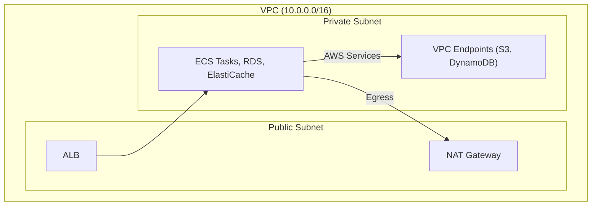
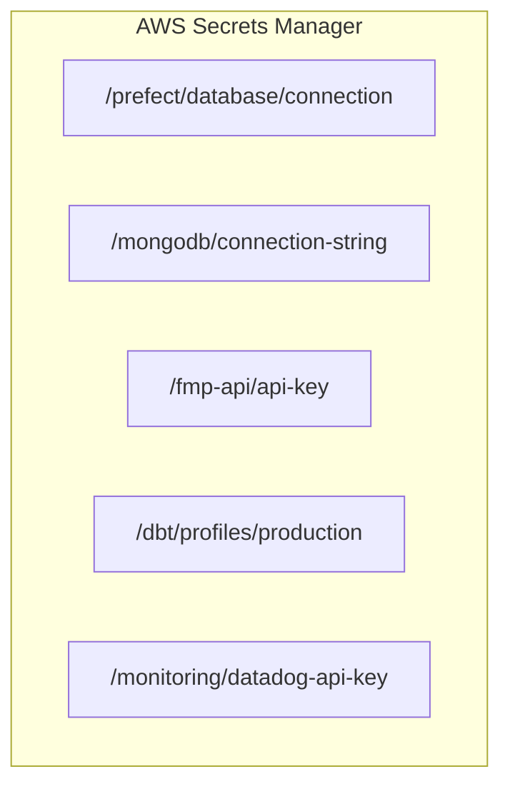

## Security Architecture

### Network Security

### Identity & Access Management

- **Service Accounts**: Each service has minimal IAM role
- **Cross-Account Roles**: For multi-account deployments
- **Temporary Credentials**: No long-lived access keys
- **MFA Enforcement**: For human users

### Data Security

- **Encryption at Rest**: S3 SSE-S3, RDS encryption
- **Encryption in Transit**: TLS 1.2+ everywhere
- **Key Management**: AWS KMS with key rotation
- **Data Masking**: PII masked in Silver/Gold zones

### Secrets Management

