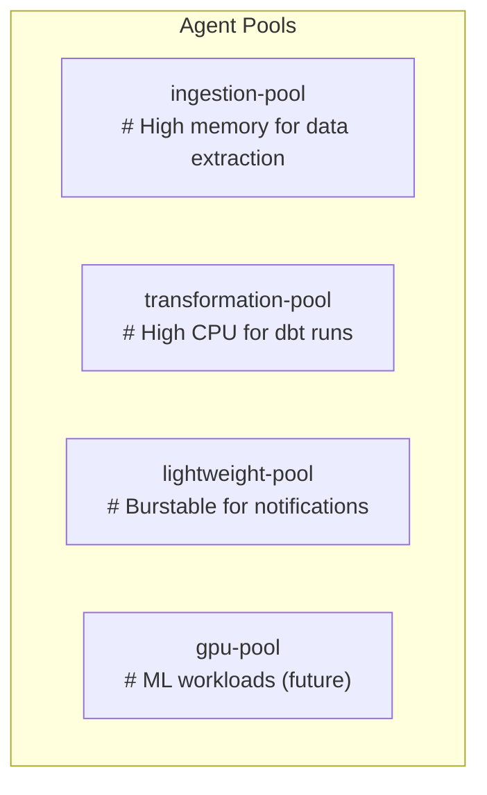

## Service Architecture

### Prefect Server Deployment

- **Infrastructure**: ECS Fargate with auto-scaling
- **Database**: RDS PostgreSQL Multi-AZ
- **Load Balancer**: ALB with SSL termination
- **Storage**: EFS for shared artifacts

### Prefect Agent Architecture



### ECS Task Patterns

#### Ingestion Tasks (Ephemeral)

- **Lifecycle**: Created by Prefect, terminated after completion
- **Resources**: Configured per data source requirements
- **Networking**: Private subnet with NAT Gateway
- **IAM Role**: Scoped to specific S3 paths and secrets

#### dbt Core on ECS (Ephemeral Tasks)

- **Deployment**: Ephemeral ECS tasks triggered by Prefect (not long-running service)
- **Architecture**:
  ```mermaid
  graph TD
    subgraph ECS Task Definition
        A["dbt Container"] --> B["dbt project pulled from Git at runtime"];
        A --> C["Profiles from Secrets Manager"];
        A --> D["Connection to Athena/Redshift"];
        E["Sidecar Container (Optional)"] --> F["Metrics collector"];
    end
  ```

```
- **Execution Model**: Each dbt run is a fresh ECS task
- **Scaling**: Unlimited parallel tasks based on workload
- **Storage**: S3 for dbt artifacts and logs
```
